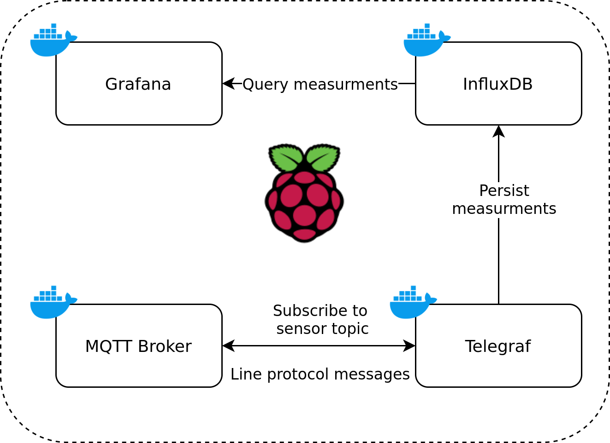

I this series of articles we will design and develop network of IoT sensors connected to the main hub running on Raspberry Pi. Data will be collected on InfluxDB time series database and visualised by Grafana. We will also host MQTT broker and use Telegraf as middle-man between MQTT messages and writing data to InfluxDB. All system blocks will be dockerized.

## Table of Contents

1. Intruduction (this article)
2. MQTT messaging protocol - broker
3. Telegraf and InfluxDB - persist data with ease
4. Visualising data with Grafana - see your data
5. IoT sensor using ESP32 and BME280 - Arduino part
6. BONUS part - collect temperature using sensor connected to Raspberry Pi, Python script and cron.

## What is good to know before beginning

- Basic knowledge about what Linux is and basic knowledge about Linux shell
- What MQTT is (I strongly recommend this brilliant tutorial [HiveMQ MQTT Tutorial](https://www.hivemq.com/mqtt-essentials/))
- Some rough knowledge about Docker - main concepts
- Arduino basic programming skills

## Hardware

- Raspberry Pi version > 3
- ESP8266 or ESP32
- BME280 / BMP280 or any other digital sensor, you will find library for everything

## Architecture

### Host

Our Raspberry Pi is a host for all data processing and persistance processes.

Building blocks contains of Docker containers configured and bounded by docker-compose file.

- MQTT Broker is subscribed to topic that sensors broadcasting their messages (measurments). Messages are formatted in [Line protocol](https://docs.influxdata.com/influxdb/v2.0/reference/syntax/line-protocol/).
- Telegraf is middle-man that understands Line protocol and knows how to put that data into InfluxDB database.
- Grafana - visualises the data without hassle.

### Sensors
